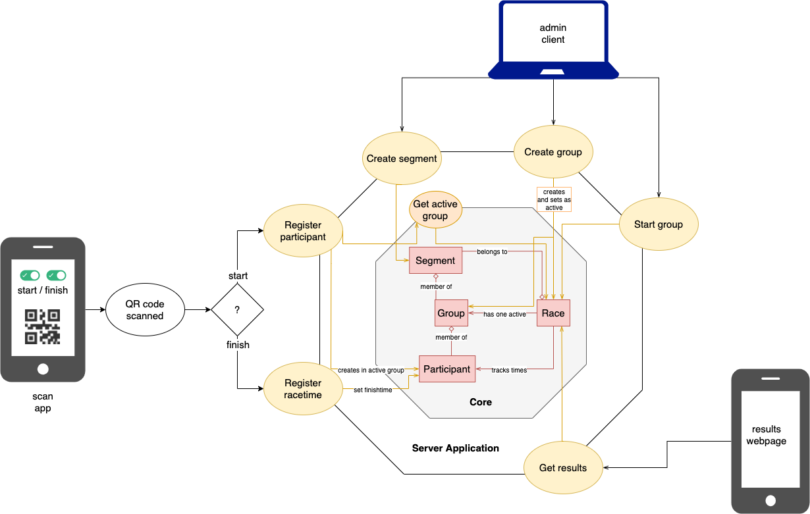

# Architecture

The whole system contains one server application, and three clients:

- The `scanner` client is able to scan QR codes, so it is able to register participants at start and finish line
- The `admin` client can be used to manage segments and groups.
- The `results` client is a public client where anyone can access the realtime timetable of the race.

The server application tries to mimic [domain-driven hexagon](https://github.com/Sairyss/domain-driven-hexagon) architecture, but with some tradeoffs (eg. ORM) to reduce boilerplate code and optimise the number of SQL queries.